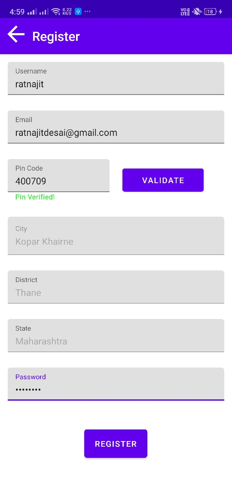
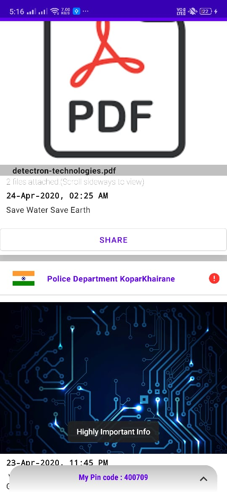
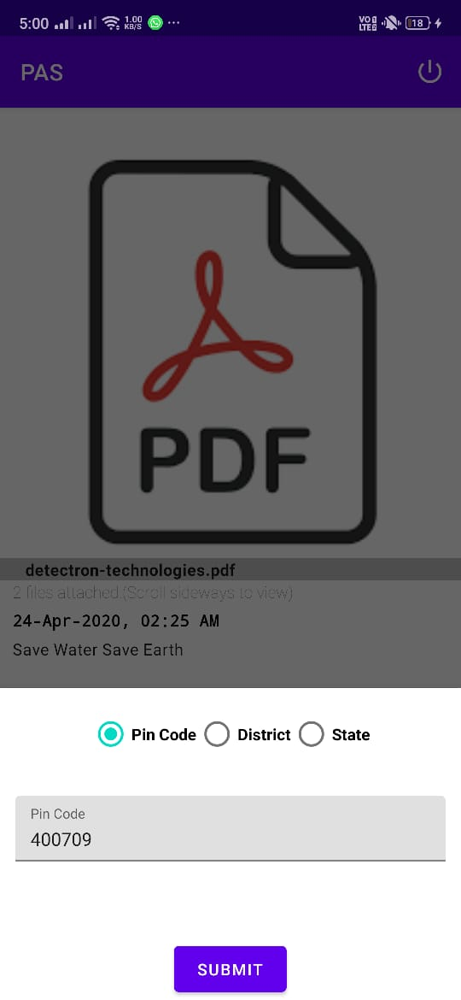

# PAS
PUBLIC ADDRESS SYSTEM

<b>THE COMPLETE CODE IS AVAILABLE UNDER BRANCH 'FINAL'<b>

Public Address system is an android based system.It consists of two applications:
1) PAS system for citizens
2) PAS system for authorities like government departments - (https://github.com/RatnajitDesai/PASDEPT)

It allows citizens to view various messages posted by government departments targeted towards the region they are currently living. 
e.g. if citizen A is living in area with pincode-123456, then all the government messages that are intended for pincode 123456 will be visible to citizen A.

The application also allows citizens to share this messages to other platforms like whatsapp, facebook etc.

1) Registration :

Registartion is done by taking citizens email id, location information like pincode, district, state etc.
Pin code validity is determined through REST API.Once clicked on registration, email verification link is sent to provided email address.  <b>Firebase authentication</b> service used for registration.
Once email is verified, citizen is allowed to sign in to application.

2) Home page:

Once signed-in, citizen can see all the posts linked to his/her pincode with latest post first.
Citizen can see all the attachments of that post. Also citizen can share the same post message to other platforms like whatsapp , facebook etc. using share button under each post.
The red icon on top right corner determines importance or priority of the post.
Clicking on Pin-code below opens up dialog to select regions other than citizens own pincode. 

3) Filter :
Fiter page allows citizens to select region based on pincode, district or state.

